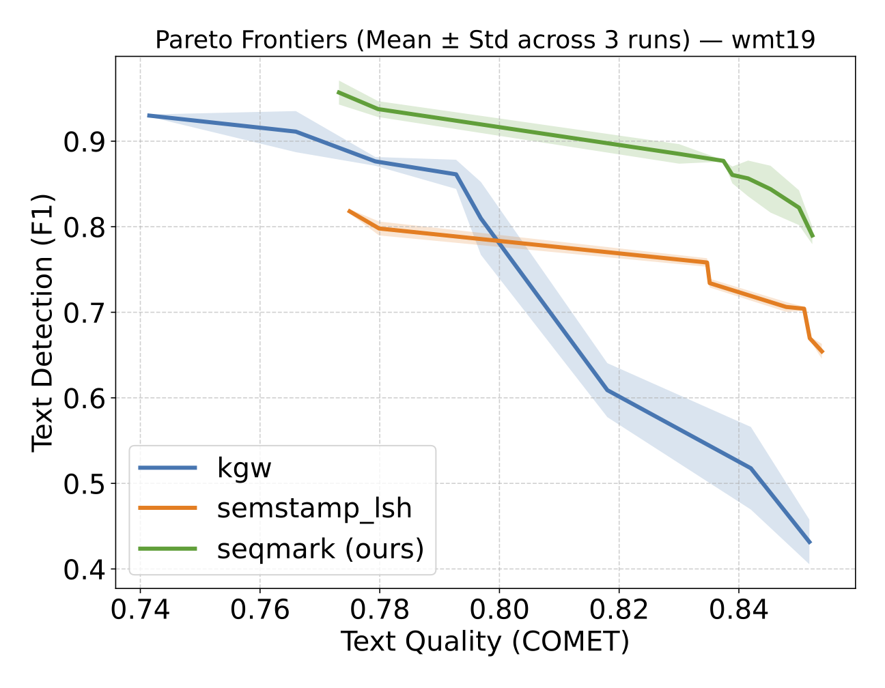
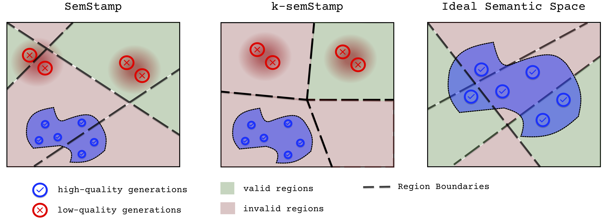
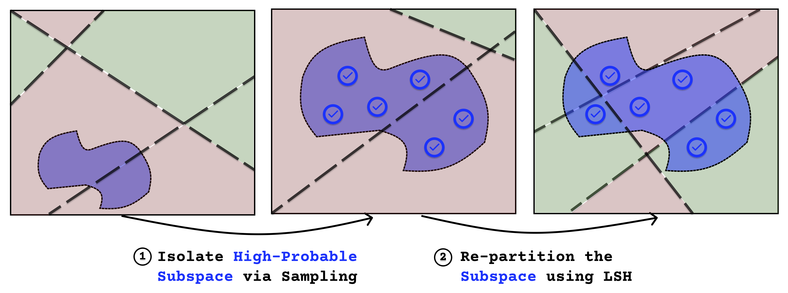

## SeqMark: Semantic Differentiation for Watermarking Low-Entropy Text
Nghia T. Le (in collaboration with Alan Ritter and Kartik Goyal)
 
Table of Content:
* [Introduction](#introduction)
* [Token-level Watermarking and Text Entropy](#token-level-watermarking-text-entropy-under-utilization)
* [Sequence-level Watermarking: Region Collapse and SeqMark](#sequence-level-text-watermarking-region-collapse-and-seqmark)
* [Further Discussion](#discussion-open-questions--limitations-)
* [Citation](#citation)

---


### Introduction

The proliferation of AI-generated content has created an urgent need for digital watermarking approaches that can robustly track provenance ([Srinivasan et al.](https://www.brookings.edu/articles/detecting-ai-fingerprints-a-guide-to-watermarking-and-beyond/)). There have been various efforts to create robust and imperceptible text watermarking methods ([Kirchenbauer et al.](https://arxiv.org/abs/2301.10226), [Aaronson](https://scottaaronson.blog/?p=9333), see survey by [Liu et al.](https://doi.org/10.1145/3691626)). Major LLM providers have also begun implementing watermarking in production ([SynthID](https://deepmind.google/models/synthid/), [Claude text watermarking](https://www.anthropic.com/news/claude-text-watermark)). Nonetheless, these approaches often struggle with watermarking *low-entropy* constrained generation tasks such as machine translation, code summarization, and code generation, due to the limited randomness available at each token sampling step for these tasks. Researchers have tackled this issue by improving *token-level watermarking* for code generation ([Lee et al.](https://arxiv.org/abs/2305.15060), [Lu et al.](https://arxiv.org/abs/2403.13485)) and translation ([Takezawa et al.](https://arxiv.org/abs/2310.00833)). Interestingly, we find that these approaches still underperform *sequence-level watermarking* ([Hou et al.](https://arxiv.org/abs/2310.03991)), which we hypothesize is due to *entropy under-utilization* in constrained generation tasks. Nonetheless, sequence-level watermarking algorithms suffer from *region collapse*, a problem where the model is often forced to choose between generating high-quality but un-watermarked text or low-quality watermarked text. We thus introduce SeqMark, a sequence-level watermarking algorithm that tackles the region collapse problem by isolating and differentiating the high-quality output space. We observe that SeqMark improves text watermarking performance across different low-entropy scenarios.


---
### Token-level Watermarking: Text Entropy Under-Utilization (I don't like this title ...)

Popular LM watermarking algorithms often embed watermark signals at the token level, relying 
on each token step having high enough entropy (i.e., randomness) to watermark without major degradation in text quality. For constrained generation tasks, this is problematic: there are 
much fewer token steps with high-enough entropy for watermarking. Consider the following example where we translate a German sentence into English:

<style>
    .hoverable {
        position: relative;
        cursor: pointer;
    }
    .hoverable:hover::after {
        content: attr(data-hover-content);
        white-space: pre-line;
        position: absolute;
        top: 100%;
        left: 0;
        color: black;
        background-color: #FFFFFF;
        padding: 5px;
        border: 2px solid #ccc;
        border-radius: 5px;
        z-index: 100;
        width: 180px; 
    }
</style>
<h4></h4><p><b>German</b>: New York ist als die Stadt bekannt, die niemals schläft</p><p><b>English</b>: <span style='background-color: rgba(255, 176, 66, 1.0); color: black' class="hoverable"data-hover-content="nobody: 0.0083
 фев: 0.0072
 Hinweis: 0.0071
 everybody: 0.0067
 Unterscheidung: 0.0061
 Begriffe: 0.0057
 проф: 0.0050
 Einzeln: 0.0046
 сайт: 0.0040
nahm: 0.0038
"> New</span><span style='background-color: rgba(255, 176, 66, 0.005390980963238809); color: black' class="hoverable"data-hover-content="York: 0.9949
 y: 0.0018
y: 0.0009
Y: 0.0004
-: 0.0002
 Orleans: 0.0002
 Y: 0.0001
ark: 0.0001
 Jersey: 0.0001
</s>: 0.0001
"> York</span><span style='background-color: rgba(255, 176, 66, 0.0327434324864075); color: black' class="hoverable"data-hover-content="is: 0.9396
 City: 0.0439
 has: 0.0084
,: 0.0020
 was: 0.0020
': 0.0010
 city: 0.0007
 as: 0.0002
ers: 0.0001
 gets: 0.0001
"> is</span><span style='background-color: rgba(255, 176, 66, 0.11604020184359765); color: black' class="hoverable"data-hover-content="known: 0.7861
 famous: 0.0896
 well: 0.0265
 ren: 0.0230
 the: 0.0140
 referred: 0.0051
 also: 0.0049
 a: 0.0045
 often: 0.0037
 inf: 0.0033
"> known</span><span style='background-color: rgba(255, 176, 66, 0.040193369837399934); color: black' class="hoverable"data-hover-content="as: 0.9301
 for: 0.0449
 to: 0.0107
 by: 0.0034
 around: 0.0025
,: 0.0010
 world: 0.0009
 col: 0.0007
 the: 0.0006
 all: 0.0004
"> as</span><span style='background-color: rgba(255, 176, 66, 0.07614935667604043); color: black' class="hoverable"data-hover-content="the: 0.8551
 a: 0.0759
 ': 0.0231
 ': 0.0108
 city: 0.0096
 The: 0.0094
 being: 0.0031
 City: 0.0011
 ‘: 0.0009
 one: 0.0008
"> the</span><span style='background-color: rgba(255, 176, 66, 0.02592359023275274); color: black' class="hoverable"data-hover-content="city: 0.9630
 City: 0.0158
 ': 0.0075
 place: 0.0051
 ': 0.0024
 town: 0.0021
 : 0.0005
 never: 0.0005
 Big: 0.0002
 “: 0.0001
"> City</span><span style='background-color: rgba(255, 176, 66, 0.08255140499712434); color: black' class="hoverable"data-hover-content="that: 0.6610
 That: 0.3272
That: 0.0010
 Never: 0.0008
 which: 0.0008
that: 0.0006
,: 0.0005
 of: 0.0005
-: 0.0004
 where: 0.0004
"> That</span><span style='background-color: rgba(255, 176, 66, 0.003627511860913247); color: black' class="hoverable"data-hover-content="Never: 0.9961
 Does: 0.0022
 never: 0.0006
N: 0.0003
 Ne: 0.0002
 NE: 0.0001
 Just: 0.0001
 (: 0.0001
': 0.0001
 Always: 0.0000
"> Never</span><span style='background-color: rgba(255, 176, 66, 0.006222259292701012); color: black' class="hoverable"data-hover-content="S: 0.9946
 St: 0.0014
 sle: 0.0007
 Sl: 0.0002
 Dies: 0.0002
 R: 0.0002
S: 0.0001
 Sh: 0.0001
 C: 0.0001
 L: 0.0001
"> S</span><span style='background-color: rgba(255, 176, 66, 0.09956700946417466); color: black' class="hoverable"data-hover-content="le: 0.8253
leep: 0.0926
its: 0.0269
ets: 0.0149
lee: 0.0032
</s>: 0.0019
we: 0.0015
.: 0.0014
LE: 0.0009
ells: 0.0008
">le</span><span style='background-color: rgba(255, 176, 66, 0.21622956736395796); color: black' class="hoverable"data-hover-content="eps: 0.7851
ets: 0.0138
ems: 0.0103
</s>: 0.0096
pt: 0.0067
e: 0.0059
em: 0.0047
...: 0.0036
E: 0.0033
.: 0.0032
">eps</span></p>

In this example, the token steps with higher entropy are highlighted with a darker shade \footnote{we compute token entropy at step i: $H(x_i | x_{<i}) = -\sum_{v\in V} P(x_i\mid x_{<i}; \theta) \log P(x_i\mid x_{<i}; \theta)$ over all token v in vocabulary V with (translation fine-tuned) language model =ALMA-7B (cite)} (we also show top-10 most probable tokens and their probabilities). We can see that a few tokens have notable entropy ("New", "known", "That", "eps"), 
with the first token having the highest value, while the rest are essentially deterministic.
Token-level watermarking approaches are therefore constrained to these few tokens high entropy tokens. In contrast, consider the following possible translation sequences: 
```
New York is known as the City That Never Sleeps. 
New York City is known as the city that never sleeps.
New York is famous as the city that never sleeps.
The reputation of NYC is the city that never sleeps
New York is known for being the city that never sleeps.
The city that never sleeps, that’s New York City.
New York is the city that never sleeps.
New York is famous as the city that never sleeps.
NYC is known as the city that never sleeps
New York is well-known for being the city that never sleeps.
NYC is often regarded as a city that never sleeps.
New York is famous for never sleeping.
...
```
Watermarking algorithms that utilize selection over the above set of (infinite) sequences would theoretically leverage more randomness for effective watermarking. We posit that this is where sequence-level watermarking algorithms like [SemStamp](https://arxiv.org/abs/2310.03991) have an advantage over token-level watermarking: the utilization of the (infinite) sequence embedding space 
allows for more randomness when watermarking constrained generation tasks. Empirically, in Figure 1 below we observe that sequence-level watermarking [SemStamp](https://arxiv.org/abs/2310.03991) (orange) achieves a higher Pareto frontier for higher-quality translations than the token-level algorithm [KGW](https://arxiv.org/abs/2301.10226) (blue): 

<figure style="text-align: center;">
  
  <figcaption style="text-align: left;">
  Figure 1: Text Detection vs. Text Quality for three watermarking algorithms on machine translation: token-level KGW (blue), sequence-level SemStamp (orange), and our work SeqMark (green)</figcaption>
</figure>

However, it turns out that sequence-level text watermarking has a critical issue of its own when watermarking constrained generation tasks: *region collapse*.

---
### Sequence-level Text Watermarking: Region Collapse and SeqMark

Sequence-level watermarking works by (1) partitioning the embedding space into accepted/valid and rejected/invalid regions, (2) generating and mapping candidate sequences onto the partitioned space (3) selecting the sequences that fall into the accepted regions. The underlying assumption for this method is that similar sequences share similar embeddings. This is problematic when it comes to constrained generation tasks: all the "high-quality" generations risk being partitioned into the invalid regions. For example, for machine translations, if all the correct translations fall into the invalid regions, the model is forced to choose between correct but un-watermarked sequences vs. incorrect but watermarked sequences (Figure 2). We call this problem **Region Collapse**.

<figure style="text-align: center;">
  
  <figcaption style="text-align: left;">Figure 2: Illustrations of Region Collapse in sequence-level watermarking algorithms SemStamp (left) and k-SemStamp (middle). In the ideal semantic space (right), low-quality generations are ignored and only the space of high-quality generations are considered for watermarking.</figcaption>
</figure>

To alleviate region collapse, our approach SeqMark (Figure 3) first isolates the manifold C of high-probable generations via sampling (i.e., sampling n candidate translations). We then seek a transformation f that minimizes the pairwise cosine similarities between the members of C while preserving their relative proximity. This is difficult to estimate in general and could be approximated by learning such a function via a neural network. We opt for a much simpler choice for f : subtracting
the sample mean from each member of C. 

<figure>
  
  <figcaption>Figure 3: SeqMark avoids region collapse by first (1) isolating the high-probable subspace via sampling and (2) partitioning this subspace and selecting the sequences for watermarking</figcaption>
</figure>

We summarize the main results in Table 1 below. Across four different constrained generation tasks (sentence translation, paragraph translation, summarization, and code generation), we observe that SeqMark achieves significant watermark detection improvement over previous approaches, with no degradation in text quality.


**Table 1.** Utility and watermark detection performance across different tasks. Each entry reports task accuracy / watermark detection performance.
| Method  | Sentence Translation (WMT19) | Paragraph Translation (WMT23) | Summarization (XSUM) | Code Generation (MBPP) |
|---|---:|---:|---:|---:|
| No Watermark | 87.4 / - | 87.1 / - | 69.0 / - | 33.8 / - |
| KGW  | 87.4 / 45.7 | 87.7 / 72.1 | 68.8 / 44.9 | 15.0 / 45.7 |
| SWEET | 87.2 / 39.5 | 87.4 / 60.6 | 68.7 / 51.1 | 33.2 / 70.2 |
| SemStamp   | 87.4 / 65.9 | 87.5 / 84.0 | 68.7 / 60.4 | 34.2 / 69.2 |
| k-SemStamp | 87.5 / 43.4 | 87.6 / 53.5 | 68.9 / 31.3 | 34.0 / 65.2 |
| SeqMark | 87.1 / 77.1 | 87.7 / 100 | 68.5 / 89.7 | 33.6 / 80.7 |


---
### Further Discussion

In this blog post, we introduce SeqMark, a sequence-level text watermarking algorithm for constrained generation. We demonstrate that for these types of tasks, sequence-level watermarking is more effective than token-level watermarking, yet still affected by the problem of region collapse. SeqMark successfully alleviates this issue and shows significant watermark detection accuracy across different constrained generation tasks.

Despite its effectiveness, the development of SeqMark raises several open questions: 
- Computational Efficiency: sequence-level watermarking algorithms such as SeqMark are less efficient than token-level watermarking, due to the sampling of candidate sequences step. How to improve the computational efficiency of sequence-level watermarking is an open question. 

- Approximation and Transformation of the High-quality Manifold: Currently, SeqMark approximates this manifold by sampling candidate sequences, and transforms it by subtracting their embeddings from the mean embedding. One limitation of this approach is that it requires saving the mean embeddings for the detection step, which could be cumbersome to store. In general, SeqMark would benefit from approaches that improve the approximation and transformation of this high-quality subspace.

We wish to explore these questions further in future work. 

---
### Citation

Please cite this work as:

```
Le, Nghia T., Ritter, Alan and Goyal, Kartik. "Semantic Differentiation for Tackling Challenges in Watermarking Low-Entropy Constrained Generation Outputs",
Conference on Language Modeling, Oct 2026.
```

Or use the BibTeX citation:
```
@inproceedings{le2026seqmark,
  title={Semantic Differentiation for Tackling Challenges in Watermarking Low-Entropy Constrained Generation Outputs},
  author={Le, Nghia T. and Ritter, Alan and Goyal, Kartik},
  booktitle={Conference on Language Modeling (COLM)},
  year={2026},
  url={https://arxiv.org/abs/2601.11629}
}
```

